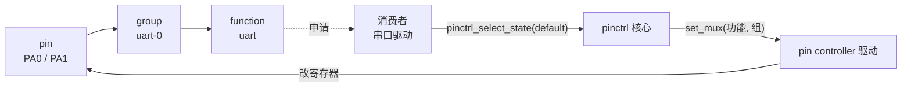

# pinctrl_demo —— pinctrl 子系统原理

一个文件讲清一件事：**引脚寄存器为什么不能谁都写，pinctrl 是怎么把这件事管起来的。**

```bash
cd C/pinctrl_demo
make func     # 每个函数单独调用一遍, 看输入->输出, 最基础
make steps    # "配置一个模式"的几步, 每步打印寄存器
make run      # 原理版: 配置写死在 C 里
make dts      # 设备树版: 配置全在 board.dts / board-bad.dts
```

两个 demo 都不需要内核、不需要 root、不需要硬件。

位域/取值/写寄存器的规则见 [`REGISTERS.md`](REGISTERS.md)。

---

## 一、三层抽象（pinctrl 的全部世界观）



- **pin**：一个物理引脚，背后一个寄存器（MUX / PULL / DRIVE / OE 几段位）。
- **group**：能**一起**切换的一组脚。单位是组不是脚 —— 否则切到一半会出现
  「PA0 已经是 UART、PA1 还是 GPIO」的中间状态，对面外设会收到垃圾。
- **function**：这组脚干什么用（uart / i2c / gpio）。一种功能可以挂在多个组上（gpio 就是全部）。

## 二、这个 demo 一步步跑给你看

| 步骤 | 输出里看什么 | 重点是 |
|---|---|---|
| ① 注册 | `pinctrl_register("demo-pinctrl")` + 户口本 | 驱动只**报户口**，不直接对外提供服务 |
| ② 消费者申请 | `set_mux(function=uart, group=uart-0)` | 核心查表 → 调驱动回调 → 驱动改寄存器 |
| ③ pinconf | `PA0 DRIVE = 8 mA` | pinmux 管"干什么用"，pinconf 管"电特性"，两条独立回调 |
| ④ strict 排他 | `[拒绝] uart-0 已经属于 "uart" → -EBUSY` | **这就是 pinctrl 存在的意义**：抢引脚在申请阶段被拦住 |
| ⑤ 让出来 | `sleep` 状态切回 gpio | gpio 是"没人用的默认态"，等于把资源交还 |
| ⑥ 反面教材 | 两个驱动直接写寄存器 | 串口 TX 突然没波形，且没人知道是谁干的 |

## 三、设备树版：把配置从驱动里挪出去

原理版把「有几组脚、每组什么功能」写死在 C 里。真实系统不这么干 —— 这是**板子**的属性,
不是**驱动**的属性: 同一颗 SoC 做成不同板子, 引脚接的东西完全不同。所以它被挪进设备树,
驱动只负责“读”。

`board.dts` 里真正生效的就是这几行:

```dts
pinctrl: pinctrl@40002000 {
	uart_pins: uart-pins {
		function = "uart";
		pins = "PA0", "PA1";
		drive-strength = <8>;	/* pinconf 也在这里 */
	};
};

uart0: serial@40003000 {
	pinctrl-names = "default", "sleep";
	pinctrl-0 = <&uart_pins>;		/* default 状态用哪组脚 */
	pinctrl-1 = <&uart_sleep_pins>;		/* sleep   状态用哪组脚 */
};
```

`dts_demo.c` 里有一个几十行的 dts 解析器(相当于内核的 `of_*` API) + 驱动匹配模型。
`make dts` 跑出来的东西: 内核把 dts 变成属性树 → 按 `compatible` 找驱动 → probe 里
`pinctrl_lookup_state("default")` → 找到 `&uart_pins` → 调 `set_mux` + pinconf:

```text
  [内核] 节点 serial@40003000 的 compatible = "demo,uart" → 匹配到驱动 demo-uart
      [核心] state="default" → pinctrl-names 里排第 0 → 读属性 pinctrl-0 = <&uart_pins>
      [pin控制器] set_mux(uart, uart-pins)
      [pin控制器] pinconf: drive-strength (=9) 应用到 PA0 PA1
      [寄存器] PA0: MUX=uart PULL=悬空 DRIVE= 8mA OE=0   (0x00000801)
  [驱动] 引脚配好了, 可以初始化寄存器、注册 tty 了
```

**写错一个字母会怎样**（`board-bad.dts` 里 `pinctrl-0 = <&uart_pin>` 少了个 `s`）:

```text
      [核心] state="default" → ... → 读属性 pinctrl-0 = <&uart_pin>
      [核心] !! 找不到标签 "uart_pin" 对应的节点 —— 设备树写错了
  [内核] serial@40003000 的 probe 失败 → 这个设备起不来
      [寄存器] 失败之后: 引脚全都没配(和复位值一样)
```

这就是设备树最典型的翻车方式：**驱动、设备号、/dev 节点全都正常，硬件就是不动**。
`dmesg` 里只有一行 `probe of serial@40003000 failed with error -19`，得回头去看 dts。

顺带一句：运行中切状态也是这一套 —— `pinctrl_select_state(p, "sleep")` 只是把
`pinctrl-names` 里第 1 个名字对应的 `pinctrl-1` 拿出来用而已。

> 自己改着玩：把 `board.dts` 里 `uart-pins` 的 `pins` 改成 `"PA2", "PA3"`，
> 或者把 `bias-pull-up` 换成 `bias-pull-down`，再 `make dts` 看寄存器怎么变。

---

## 四、和真实内核的对应关系

| demo 里 | 真实内核里 | 谁写 |
|---|---|---|
| `struct pinctrl_desc` + 户口本表 | `struct pinctrl_desc`（pins / pctlops / pmxops / confops） | pin controller 驱动 |
| `demo_set_mux()` | `pinmux_ops.set_mux()` | pin controller 驱动 |
| `demo_pin_config_set()` | `pinconf_ops.pin_config_set()` | pin controller 驱动 |
| `struct consumer consumers[]` | 设备树里的 `pinctrl-names` / `pinctrl-0 = <&uart_pins>` | 设备树 |
| `parse_dts()` + `dt_tokens()` | `of_*` API（`of_property_read_string_array` / `for_each_of_phandle_args`） | 内核 |
| `apply_pinconf_from_dt()` | `pinconf_generic_dt_node_to_map()`（把 `bias-pull-up` 之类的属性变成 config） | 内核 |
| `board.dts` / `board-bad.dts` | 板子的 `.dts`（`dtc` 编成 `.dtb`，bootloader 交给内核） | 板级工程师 |
| `pinctrl_select_state(&c)` | `devm_pinctrl_get()` + `pinctrl_lookup_state()` + `pinctrl_select_state()` | 消费者驱动 |
| `param=5 / 9 / 18` | `PIN_CONFIG_BIAS_PULL_UP=5` / `DRIVE_STRENGTH=9` / `OUTPUT_ENABLE=18` | 内核 uapi |

（demo 里那几个参数编号是**照着真实内核枚举抄的**，所以调试时你在
`/sys/kernel/debug/pinctrl/*/pinconf-pins` 看到的数字跟这里一致。）

## 五、容易搞混的四件事

1. **pinmux ≠ pinconf**：前者是"这个脚接给谁"（功能选择，通常互斥）；
   后者是"这个脚的电特性"（上下拉、驱动能力、施密特、压摆率），两者可以并存。
2. **设备树不是必须的**：老平台用 `pinctrl_register_mappings()` 静态表，
   现在是设备树/ACPI。但两边最终都会变成"function + group"这一对。
3. **strict 的含义**：`pinmux_ops.strict = true` 表示"一个脚只能属于一个 function"，
   核心会帮你拦住冲突；不设的话就得自己保证，很容易出 bug。
4. **不认识的参数要报错**：`pin_config_set()` 里遇到没实现的 `PIN_CONFIG_*`
   必须返回 `-ENOTSUPP`，静默忽略会让用户以为配置成功了。

## 六、真机版长什么样（这里不塞进 demo）

真 pinctrl 驱动是一个 **platform driver**，注册发生在 `probe()` 里：

```c
static int demo_probe(struct platform_device *pdev)
{
	desc.name = "demo-pinctrl";
	desc.pins = demo_pins;      desc.npins = ARRAY_SIZE(demo_pins);
	desc.pctlops = &demo_pctlops;     /* 户口本 */
	desc.pmxops = &demo_pinmux_ops;   /* set_mux */
	desc.confops = &demo_pinconf_ops; /* pin_config_set */
	desc.owner = THIS_MODULE;

	pctldev = pinctrl_register(&desc, &pdev->dev, NULL);
	...
}
```

注册成功后就能在 `/sys/kernel/debug/pinctrl/` 下看到它报的户口本和每个脚当前状态
（那正是 demo 里 `pctl_show()` 打印的那些内容）。
