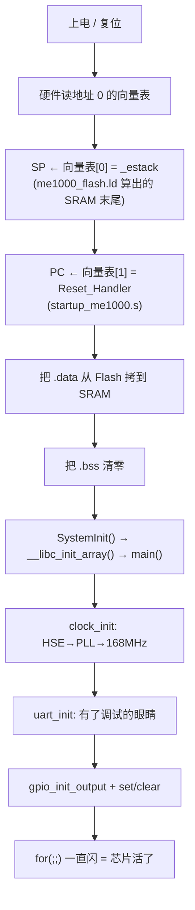

# soc_boot —— 从 0 到 main，点亮一块 SoC

一份「芯片是怎么活过来的」最小可跑 demo。不看规格书、不背寄存器，
只把**上电到点灯这条链路上的每一环**摆出来，并且每环都能亲眼看到。

```bash
make run      # 主机模拟版：整个过程直接打印出来（推荐先看这个）
make          # 顺带交叉编译出真机固件 build/soc_boot.elf / .bin
```

---

## 一、它想说明的核心问题

PC 上写 C，`main` 是"第一个"函数；芯片上，`main` 是**最后一个**被调到的函数。
中间那段空白，就是启动代码要填的：

| 上电时芯片的状态 | 后果 |
|---|---|
| 栈指针 SP 还没有值 | 任何函数调用、任何局部变量都会崩 |
| 有初值的全局变量还躺在 Flash 里 | 读 `g_banner` 得到的是错的 |
| 没初值的全局变量是 SRAM 里的随机数 | C 标准要求它们是 0，但没人做过 |
| 时钟还是默认的低速内部 RC | 串口波特率、定时器全按错的值算 |

所以"点亮一块板子"（bring-up）的判定标准很朴素：
**能打印出正确的话 + 能控制引脚**。做到这两条，说明上面四件事全解决了。

---

## 二、上电之后到底发生了什么



前三步是硬件做的（只有两步，加一个跳转），中间三步在 `startup/startup_me1000.s`，
后面全是普通的 C 代码 —— 难点只在"分界线在哪"。

### 常规启动文件的三个约定

工程上的启动文件（`startup_me1000.s`，就是 ST 的 `startup_stm32f4xx.s` 那个位置）
都会多带三样东西，因为这个文件是要被全项目的代码复用的，不是一个人用一次：

| 约定 | 解决什么 | 长什么样 |
|---|---|---|
| **weak 中断处理函数** | 芯片手册上几十上百个中断，不可能都写实现 | 汇编里就两行一组：`.weak NMI_Handler` + `.thumb_set NMI_Handler,Default_Handler`，谁要用谁在 `src/me1000_it.c` 里定义同名函数，链接器自动挑强符号 |
| **`SystemInit()`** | 时钟 / Flash 等待周期这些要在 `main` 之前配好 | 接口在 `include/system_me1000.h`，实现在 `system/system_me1000.c`。这就是为什么用 SDK 时 `main` 一进去时钟就已经是好的 —— 它是被启动文件叫起来的，不是 `main` 自己配的 |
| **`__libc_init_array()`** | C++ 全局对象构造、`__attribute__((constructor))` | 遍历链接脚本里的 `.init_array` 段，逐个调构造函数。纯 C 时它是空转，但反正要留位 |

顺带两个只有真会踩到的坑：

- `__libc_init_array()` 内部会调一次 `_init()`，这个符号本来由 `crti.o` 提供；
  我们用 `-nostartfiles` 不链那套启动代码，所以得自己补一个空壳（见 `startup/startup_me1000.s`）。
- 启动文件里的 `.ltorg` 不能忘：`ldr r0, =_sdata` 这类写法靠汇编器生成字面量池，
  不显式落一脚的话，池子可能被放在太远的地方导致汇编报错。
- 链接脚本里那些 `. = ALIGN(4)` 不能乱放：空段里对不齐的话，段会被撑出几个字节。

---

## 三、文件分工：行业里就是这么分的

```
soc_boot/
├── Makefile
├── me1000_flash.ld      # 链接脚本：内存布局
├── include/             # 对外头文件
│   ├── me1000.h                器件头文件：地址映射、寄存器位、板子接线
│   ├── system_me1000.h         芯片级初始化接口
│   ├── bsp_gpio.h
│   └── bsp_uart.h
├── startup/             # 启动文件
│   └── startup_me1000.s        向量表 + Reset_Handler（就是那个 start 文件，汇编）
├── system/              # 芯片级初始化
│   └── system_me1000.c         SystemInit()：时钟树
├── bsp/                 # 板级驱动 BSP
│   ├── bsp_gpio.c
│   └── bsp_uart.c
├── src/                 # 应用
│   ├── main.c                  业务入口
│   └── me1000_it.c             中断服务程序
└── sim/                 # 本项目额外加的：主机模拟（真机固件里一个字节都不含）
    ├── soc_sim.c               虚拟硬件
    ├── soc_sim.h
    └── host_entry.c            PC 版启动代码
```

换成任何一颗 Cortex-M 芯片，这份目录都不用变，只是文件名跟着芯片型号走：

| 本工程 | 行业里常见的名字 | 是什么 |
|---|---|---|
| `startup/startup_me1000.s` | `startup_stm32f4xx.s` | 向量表 + `Reset_Handler`，纯汇编，唯一和芯片强绑定的文件 |
| `system/system_me1000.c` | `system_stm32f4xx.c` | `SystemInit()`：时钟、Flash 等待周期 |
| `src/me1000_it.c` | `stm32f4xx_it.c` | 中断服务程序：覆盖启动文件里的 weak 版本 |
| `include/me1000.h` | `stm32f4xx.h` | 器件头文件：寄存器地址和位定义 |
| `bsp/*.c` | `bsp_xxx.c` / `hal_xxx.c` | 板级驱动：把寄存器包装成好用的函数 |
| `src/main.c` | `main.c` | 业务代码 |
| `me1000_flash.ld` | `STM32F407VGTx_FLASH.ld` | 链接脚本 |

**最小可运行集合其实是 4 个文件**：链接脚本 + 启动文件 + 一份实现 + Makefile。
`system/` 和器件头文件之所以人人都有，是因为"配时钟"和"寄存器地址"这两件事躲不掉；
`bsp/` 和 `_it.c` 是工程化之后为了可维护才拆出来的。

每个文件的职责：

| 文件 | 关键一句话 |
|---|---|
| `me1000_flash.ld` | 决定每一段东西住在芯片哪个地址。`.data` 的**出厂位置在 Flash、运行位置在 SRAM**，这条"两地分居"是启动代码存在的根本原因 |
| `startup/startup_me1000.s` | 向量表前两格就是 SP 和 PC。复位入口只用汇编写，因为它是来修 `.data` / `.bss` 的，**此时一切全局变量都还不可信** |
| `system/system_me1000.c` | 时钟三步：开源头 → 配 PLL → 切过去，每步都是「写请求 → 等 RDY → 回读确认」 |
| `src/me1000_it.c` | 中断入口集中一处，便于查重。没实现的中断会掉进 `Default_Handler` |
| `include/me1000.h` + 访问层 | 全工程唯一碰寄存器的地方。"外设 = 一段有地址的内存" |
| `bsp/bsp_uart.c` | 分层：格式化（纯软件，PC 上一样）＋ `uart_putc`（换输出端不换业务） |
| `src/main.c` | bring-up 的最小闭环：拿时钟 → 有输出 → 控制引脚 |
| `sim/*` | 主机专属：虚拟硬件 + PC 版启动代码 |

---

## 四、三个能带走的思路

**1. 外设就是一段内存。**
`*(volatile uint32_t *)0x40000000 |= (1u<<16)` 就是"打开外部晶振"。
`volatile` 不能省，否则编译器认为"写进去又没人读"，把整条语句优化掉 ——
这是嵌入式里最经典的「代码凭空消失」事故。

**2. 硬件比软件慢，一律「请求 → 等就绪 → 回读确认」。**
`HSEON` 是我写下去的要求，`HSERDY` 是硬件给的答复；
`SW` 是"我要切到谁"，`SWS` 是"现在实际是谁"。
把这两个搞混，会在真机上得到一个偶尔能跑、偶尔跑飞的程序 —— 最难查的那种。

**3. 把不确定的东西压缩到最薄的一层，代码就能在 PC 上跑。**
驱动代码两边完全一样，区别只在 `REG_W/REG_R` 两个宏（`include/me1000.h`）：

```c
真机：*(volatile uint32_t *)addr = val;     // 一条指令，直达电路
主机：sim_mmio_write(addr, val);            // 转给 sim/soc_sim.c 做反应
```

`make run` 跑的就是这条路：你看到的每一行输出，都是**真机要烧进去的那份
`system/system_me1000.c` / `bsp/bsp_gpio.c` / `bsp/bsp_uart.c` / `src/main.c`**
产生的（`main.c` 一个字符没改，只是编译时 `-Dmain=firmware_main` 换了个名字，
好让主机入口来当 `main`）。
QEMU 模拟整个芯片用的也是同一个原理，只不过它把"反应"做到了指令级。

---

## 五、真机版长什么样

```bash
make elf
xxd -l 16 build/soc_boot.bin
# 00000000: 0050 0020 4900 0008
#           └ 0x20005000 = 栈顶    └ 0x08000049 = Reset_Handler（最低位 1 表示 Thumb）
```

烧进芯片的就是这个 `.bin`：头 8 个字节必须是"栈顶 + 复位入口"，
芯片一上电就照这两个数去干活。接着的每一格都是异常/中断入口，
本例是 18 格（16 个系统异常 + 2 个外设中断），正好 `0x48` 字节。

有意思的是第 4 个字（HardFault）：它是 `0x08000459`，指向 `src/me1000_it.c`
里的实现，而不是启动文件里的 `Default_Handler` —— `.weak` + `.thumb_set` 的效果
直接盯在二进制里。用 `make size` 看占了多大：

```
   text    data     bss     dec     hex filename
   1496      34       8    1538     602 build/soc_boot.elf
     │        │      └ 8 字节 .bss：g_led_on + g_tick_ms，不占 Flash，开机现清零
     │        └ 34 字节 .data：有初值的全局变量（含 SystemCoreClock），Flash 存一份，开机搬进 SRAM
     └ 向量表(72B) + 代码 + 常量，住 Flash
```

换成别的芯片，要改的其实就三处：
`include/me1000.h` 里的地址和寄存器位、`me1000_flash.ld` 里的内存布局、
`Makefile` 里的 `-mcpu`（外加 `system/system_me1000.c` 里的晶振/PLL 那几行数字）。
其余文件的命名把 `me1000` 换掉即可 —— 这也是为什么工程里到处都带器件名前缀。

---

## 六、这个 demo 故意没做的事

为了主线清楚，下面这些真实工程里必须有的东西都省了：

- **中断真的跑起来**：`src/me1000_it.c` 里 `HardFault_Handler` / `SysTick_Handler` /
  `IRQ0_Handler` 都写好了（也验证了 weak 顶替确实生效，向量表里已经指向它们），
  但没开 NVIC、没配 SysTick 的重装载值，所以它们目前不会被调用。
  真机 bring-up 的下一步就是这里
- **Flash 等待周期 / 电压调节**：168MHz 下不设等待周期，真机会取指出错
- **引脚复用（AF）**：串口要先选复用号，这里跳过了
- **栈大小检查**：只给了栈顶，没检查栈会不会撞到 `.bss`。工程里会在链接脚本里加 `ASSERT`，
  或者往栈里填魔数、启动后回读看被啃掉多少（查栈溢出的标准手法）
- **拷贝循环用 C 写**：本例照 ST 的做法放在 `.s` 里。用 C `for` 循环也能写，
  但必须保证"拷贝完成之前不碰任何全局变量"，靠人守约定就容易出事 —— 这就是它留在汇编里的原因

细节不用深究，但**顺序不能错**：先有时钟，才有稳定的输出和可靠的时序。
