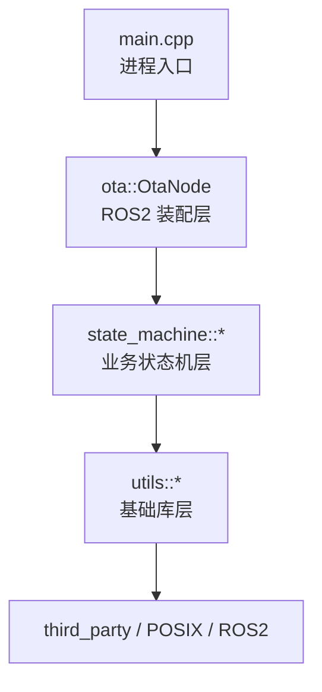
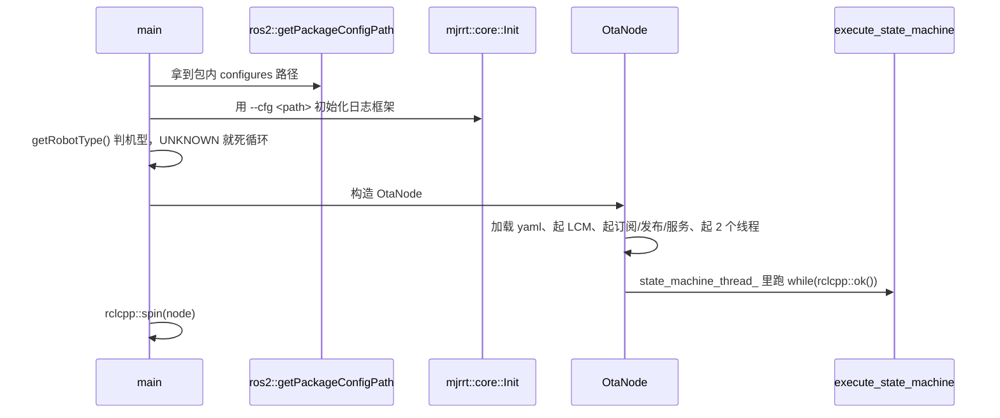
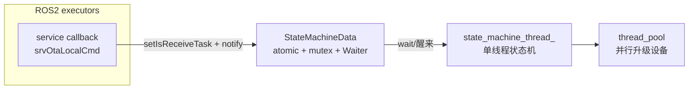
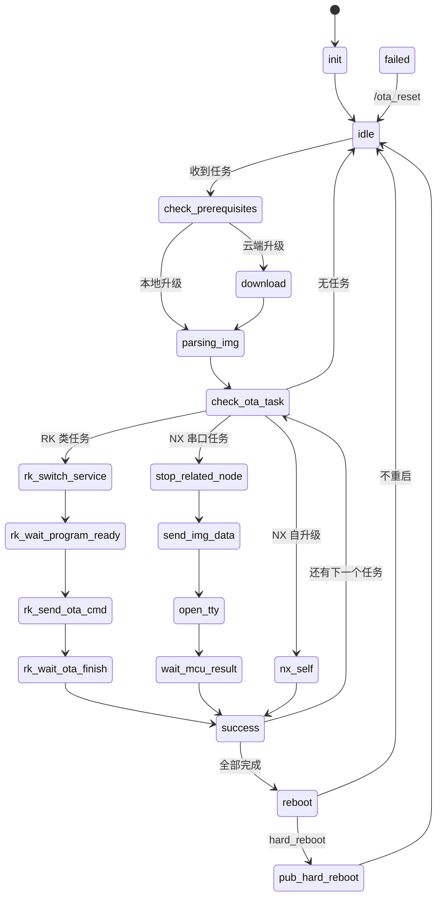

# humanoid_ota 工程总结

> 源码位置：`/home/qiurangfei/PRJ/ota/humanoid_ota`
> 技术栈：C++20 / ROS2(ament_cmake) / boost::sml / LCM / libcurl / spdlog(mjrrt) / reflect-cpp / nlohmann-json / tl::expected

---

## 1. 一句话概括

这是**人形机器人整机 OTA 升级节点**：运行在 NX（Jetson Orin）中控上，
对外暴露 ROS2 Service 接收升级指令，内部用一个**状态机**驱动
"下载 → 解析 → 逐设备升级（MCU / 电机 / RK3588 / NX 自身）→ 重启"的完整流程。

---

## 2. 技术栈一览

| 依赖 | 用途 | 在代码中的体现 |
| --- | --- | --- |
| ROS2 (rclcpp) | 服务/话题/客户端通信 | `create_service`、`create_subscription`、`create_client` |
| boost::sml | 编译期状态机 | `state_machine.hpp` 里的 `make_transition_table` |
| LCM | 与 RK3588 通信取电机版本号 | `lcm::LCM`、`subscribe("robot_motor_info")` |
| libcurl | 云端升级包下载 | `utils/curl/curl.cpp` |
| mjrrt (封装 spdlog) | 日志 | `MJR_INFO/MJR_ERROR/MJR_DEBUG/MJR_TRACE` |
| reflect-cpp | 结构体 ↔ YAML 反射映射 | `configures.hpp` 的 `rfl::NamedTuple` |
| nlohmann-json | 写版本号 json | `reboot.cpp` |
| tl::expected | 无异常的错误返回 | `FileOperator::readFile` 等 |
| thread_pool | 并发升级多设备 | `third_party/thread_pool` |

---

## 3. 目录结构

```
humanoid_ota/
├── CMakeLists.txt            # 顶层：C++20、可见性隐藏、install 规则
├── package.xml               # ament 包描述
├── cmake/                    # 自研 CMake 模块（第三方依赖引入 + 命名空间工具）
│   ├── NamespaceTool.cmake   # set_root_namespace / set_namespace / get_namespace
│   ├── GetJson.cmake GetSml.cmake GetReflectCpp.cmake GetTlExpected.cmake
│   ├── GetMjrrt.cmake GetThreadPool.cmake
├── configures/               # 各机型 yaml 配置（a2202 / a2409 / a2506 / a2203 ...）
├── launch/                   # ROS2 launch
├── scripts/nx, scripts/rk3588# 真正干活的 shell 脚本
├── tools/                    # 独立小工具：串口升级、查版本、ym 传输
├── third_party/              # json / mjrrt(submodule) / reflect-cpp / sml / thread_pool / tl
└── src/
    ├── main.cpp              # 入口
    ├── ota/                  # 业务层：节点装配 + 状态机
    │   ├── ota.hpp/.cpp      # OtaNode：服务、话题、线程装配
    │   ├── state_machine/    # 18 个状态 + 状态机框架
    │   └── task/             # 升级任务类型定义与持久化
    └── utils/                # 基础库层（每个子目录 = 一个独立静态库）
        ├── configures/       # 配置结构体 + YAML 加载
        ├── curl/             # 下载
        ├── filesystem/       # 文件/目录 + POSIX 原子写
        ├── robot_info/       # 机型 / SN / 版本号路径
        ├── ros2/             # 所有路径常量 + TTS 调用
        ├── serial/           # 串口升级协议
        ├── shell_command/    # popen 执行脚本
        ├── waiter/           # condition_variable 等待器
        ├── ethercat/ ethercat_canfd/ ethercat_canfd_adapt_board/  # 电机固件升级
```

**分层关系**：



---

## 4. 启动流程（`main.cpp`）



要点：

- `mjrrt::core::Init` 必须**在创建 ROS2 节点之前**调用，否则日志配置没生效。
- 机型异常时用 `while(true) sleep` 卡住而不是 `exit`，是为了让容器/守护进程别误判崩溃重启。

---

## 5. 线程模型

`OtaNode` 构造时起 2 个常驻线程：

| 线程 | 函数 | 职责 |
| --- | --- | --- |
| `state_machine_thread_` | `execute_state_machine()` | **单线程**串行跑状态机，状态之间用 `std::atomic<StateMachineType>` 交接 |
| `periodic_task_thread_` | `execute_periodic_task()` | 100ms 周期任务（当前为空实现，预留位） |

外加：

- `thread_pool_`：在 `CheckPrerequisites` / `Idle` 里创建，用于**并行升级多台串口设备**（`enqueue` 返回 `std::future<bool>`，最后统一 `future.get()`）。
- ROS2 回调线程：`srvOtaLocalCmd` 等**不直接改状态机**，只置 `is_receive_task` 标志 + `notify()`，由状态机线程自己醒来处理（避免多线程抢状态）。



---

## 6. 状态机全景

状态枚举用 **X-Macro** 在 `state_machine.hpp` 一处定义，自动生成
枚举、`toString`、`stringTo`、合法性集合（见 `syntax/02_xmacro_enum.cpp`）。

真正的转移表在 `Transitions::operator()()` 里，用 boost::sml 的 DSL：

```cpp
*"init"_s + event<EventIdle> = "idle"_s
, "idle"_s + event<EventCheckPrerequisites> = "check_prerequisites"_s
```

每个具体状态是一个类（`Idle`、`Download` ...），继承 `StateMachineFunction`，
在 `run()` 里干活，结束时调用 `setNextStateMachineType(...)`；
**真正的 `process_event` 发生在基类析构函数里**（见 `state_machine.cpp` 的 `~StateMachineFunction`）。



### 状态含义表

| 状态 | 中文 | 说明 |
| --- | --- | --- |
| `INIT` | 初始化 | 读机型、读上次中断状态，决定从哪继续（断点续升级） |
| `IDLE` | 空闲 | `Waiter` 阻塞等任务，收到后把升级类型/URL/版本写入磁盘 |
| `CHECK_PREREQUISITES` | 前置检查 | 电量、挂起状态（`is_hang_up`）、创建线程池、TTS 提示"请勿断电" |
| `DOWNLOAD` | 下载 | libcurl 下载 + 进度回调发布 topic + `unzip` 解压 |
| `PARSING_IMG` | 解析镜像 | 按升级类型生成任务列表，校验目录里确实有对应后缀的固件 |
| `CHECK_OTA_TASK` | 检查任务 | 按当前任务类型分发；RK 类任务先把镜像推给 RK3588 |
| `STOP_RELATED_NODE` | 停相关节点 | 执行配置里的 `should_execute_script` |
| `SEND_IMG_DATA` | 发送镜像 | 线程池并行给多个串口设备发固件 |
| `OPEN_TTY` | 打开串口 | 预留 |
| `WAIT_MCU_RESULT` | 等 MCU 结果 | 预留 |
| `NX_SELF` | NX 自升级 | 执行 deb 安装脚本 |
| `SUCCESS` | 成功 | `current_task_index++` 落盘，还有任务就回到 `CHECK_OTA_TASK` |
| `FAILED` | 失败 | 阻塞等 `/ota_reset`，然后回 `IDLE` |
| `REBOOT` | 重启 | 写版本号 json，按配置软重启/硬重启/不重启 |
| `PUB_HARD_REBOOT` | 硬重启广播 | 发消息让外部下电 |
| `RK_SWITCH_SERVICE` | RK 切服务 | 停 `humanoid_controller` |
| `RK_WAIT_PROGRAM_READY` | 等程序就绪 | 预留 |
| `RK_SEND_OTA_CMD` | 发 OTA 命令 | EtherCAT / EtherCAT-CANFD / 串口 / 自升级四种协议 |
| `RK_WAIT_OTA_FINISH` | 等 OTA 完成 | 自升级要校验 deb 安装成功并恢复 `humanoid_controller` |

---

## 7. 升级类型（UpgradeType）与任务类型（TaskType）

两者都是 X-Macro 枚举，但**职责不同**：

- `UpgradeType`：**入口**维度，来自 `/ota_local` 或 `/ota_eame` 的参数。`LOCAL_ALL`/`CLOUD` 会在 `parsing_img` 阶段展开成多个任务。
- `TaskType`：**执行**维度，是真正被逐个消费的原子任务，写入 `task_type_list` 持久化。

| UpgradeType | 展开出的 TaskType |
| --- | --- |
| `LOCAL_NX_SERIAL` | `NX_SERIAL` |
| `LOCAL_NX_ETHERNET` | `NX_ETHERCAT` |
| `LOCAL_NX_SELF` | `NX_SELF` |
| `LOCAL_RK_SERIAL` | `RK_SERIAL` |
| `LOCAL_RK_ETHERNET` | `RK_ETHERCAT` + `RK_ETHERCAT_CANFD_ADAPTER_BOARD` |
| `LOCAL_RK_SELF` | `RK_SELF` |
| `LOCAL_ALL` / `CLOUD` | 按 yaml 里的 `upgrade_sequence` 顺序展开 |

`LOCAL_ALL`/`CLOUD` 展开时会用 `hasUpgradeArtifacts()` 过滤掉升级包里不存在的模块
（例如某机型没提供 MCU 固件），避免流程空跑失败。

---

## 8. 对外接口

| 类型 | 名称 | 消息 | 说明 |
| --- | --- | --- | --- |
| Service | `/ota_local` | `common_msgs/srv/BaseString` | 本地升级，data ∈ `ALL`/`RK_MCU`/`RK_MOTOR`/`RK_SELF`/`NX_SELF`/`xxx.bin` |
| Service | `/ota_eame` | `common_msgs/srv/OtaCmd` | 云端升级，`{version, url}` |
| Service | `/ota_reset` | `common_msgs/srv/SetInt8` | 失败复位 |
| Topic(Pub) | `/ota_status` | `common_msgs/msg/OtaState` | 0=IDLE … 7=FAIL，带 `pkg_current`/`pkg_total`/`download_progress` |
| Topic(Sub) | `/battery_state` | `sensor_msgs/BatteryState` | 电量，低于 `battery_limit` 拒绝升级 |
| Topic(Sub) | `/manager/robot_hanged` | `std_msgs/Bool` | 机器人是否吊起，前置检查用 |
| LCM | `robot_motor_info` | `testing_tools_package` | 电机版本号，落盘到 `devID/mcu_version.json` |
| Client | `/voice/set_tts` | `voice_msgs/srv/SetTTS` | 语音播报 |

---

## 9. 持久化设计（重要的"断点续升级"机制）

升级过程中需要断电/重启，所以状态必须落盘。`utils::ros2` 提供了一组路径常量，
`StateMachineFunction` 提供了读写封装：

| 文件 | 内容 | 用途 |
| --- | --- | --- |
| `current_ota_state` | 状态机枚举整数值 | `INIT` 时决定从哪个状态继续 |
| `current_ota_upgrade_type` | `UpgradeType` 整数值 | 继续时还原入口类型 |
| `current_ota_package_url` | 云端 URL | 继续下载 |
| `current_ota_version` | 版本号 | 最后写进 `mcu_version.json` |
| `current_ota_task_list` | 空格分隔的 TaskType 描述名 | 继续未完成的任务列表 |
| `current_ota_task_index` | 当前任务下标 | 断点续传到第几个任务 |

`FileOperator::updateFile()` 采用 **临时文件 + rename 的原子写**：
先写 `xxx.tmp`（`O_SYNC`），把老文件 rename 成 `xxx.last`，再把 tmp rename 成正式文件。

---

## 10. 关键设计模式速查

| 模式 | 位置 | 作用 |
| --- | --- | --- |
| 状态模式 + 编译期转移表 | `state_machine/` | 每个状态一个类，`run()` 内聚业务 |
| 单例（静态成员） | `StateMachineFunction::state_machine_data_` | 全局唯一升级上下文 |
| 生产者-消费者 | `Waiter` + `atomic_bool` | 服务回调置标志，状态机线程消费 |
| 策略/工厂 | `parsing_img.cpp` 的 `getTaskArtifact` + `switch` | 按枚举选策略 |
| 分发表 | `ota.cpp` 的 `unordered_map<State, function<void()>>` | 枚举 → 处理函数 |
| RAII | `FileOperator`、`unique_ptr<FILE, deleter>` | fd / FILE* 自动回收 |
| 类型擦除回调 | `utils::curl` 的 `std::function` + `void* userdata` | 把 C 风格回调桥接到 C++ 闭包 |

---

## 11. 源码里被显式修复过的坑（值得学习）

工程注释里保留了几处真实的 bug 修复，都是状态机设计的典型陷阱：

1. **转移表缺失导致 `std::terminate`**
   `nx_self` / `stop_related_node` / `open_tty` 出错时会跳 `FAILED`，
   但转移表里没有这三条边，一旦触发就 `process_event` 返回 false → 直接崩进程。
2. **`reboot` 状态没有出口**
   原实现从 `reboot` 只转移到自己，导致状态机永久卡死，一次 OTA 后无法再升级。
3. **`pub_hard_reboot` 不设置下一状态**
   析构时用默认值 `INIT` 去做 `pub_hard_reboot -> init`，同样是非法转移。
4. **索引与任务列表不一致**
   `reboot` 收尾时若只清 `task_index` 不清 `task_list`，磁盘上会留下
   "索引 0 / 列表还有 2 项"的矛盾状态。

> 结论：**状态机的每一条转移边都必须显式存在**，非法转移在 boost::sml 下是硬崩溃，
> 不是打个日志继续跑。

---

## 12. 编译系统要点

顶层 `CMakeLists.txt`：

- `set(CMAKE_CXX_STANDARD 20)` + `REQUIRED ON` + `EXTENSIONS OFF`（不能用 GNU 扩展）。
- `CMAKE_CXX_VISIBILITY_PRESET hidden`：**默认隐藏符号**，只导出显式标记的。
- `option(IS_UBUNTU ...)`：区分 Ubuntu / Debian，Debian 下不编译 `src/`（没有 ROS2）。
- `install(DIRECTORY ... PATTERN PERMISSIONS ...)`：把 `configures`/`scripts`/`launch` 装成 **666/777 权限**。

`cmake/NamespaceTool.cmake` 用 **directory property** 自造了一套"目录即命名空间"的机制：
父目录 `set_root_namespace(humanoid_ota)`，子目录 `set_namespace()` 自动拼成
`humanoid_ota::ota`、`humanoid_ota::utils::curl`，对应生成
`humanoid_ota_ota` 这种静态库名 + `humanoid_ota::ota` 这种 ALIAS 名。

---

## 13. 相关例程

| 想学什么 | 看哪个例程 |
| --- | --- |
| X-Macro 生成枚举/映射 | `syntax/02_xmacro_enum.cpp` |
| boost::sml 风格的编译期状态机（用标准库手写等价物） | `examples/ota_mini/` |
| 条件变量 + 原子标志的等待/唤醒 | `syntax/06_thread_atomic_waiter.cpp` |
| `unordered_map<Enum, function<void()>>` 状态分发 | `syntax/13_function_dispatch_map.cpp` |
| 线程池 + `std::future` 并行升级 | `syntax/15_thread_pool_future.cpp` |
| 原子写文件 / POSIX IO | `syntax/10_filesystem_and_posix_io.cpp` |
| `tl::expected` 风格错误处理 | `syntax/08_optional_expected.cpp` |

完整对照表见 `docs/02_语法知识点索引.md`。
